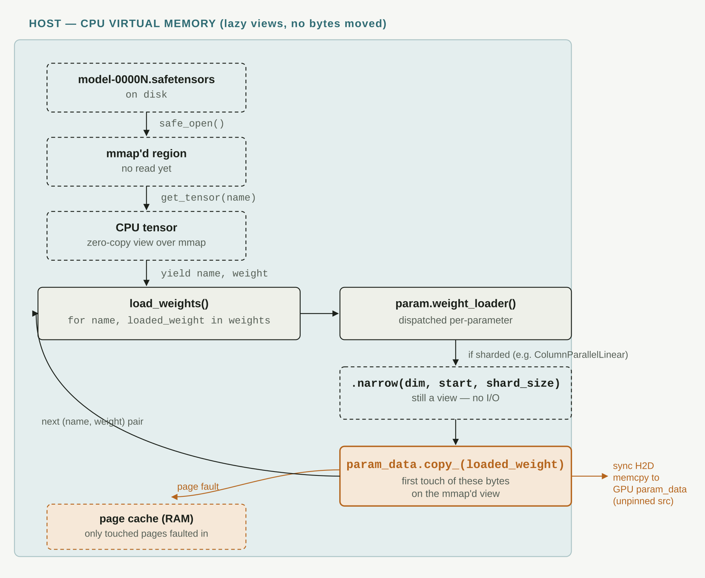
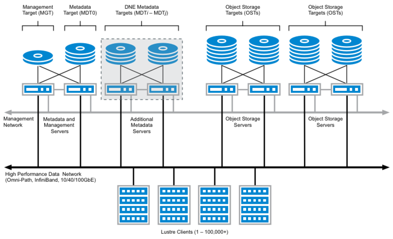
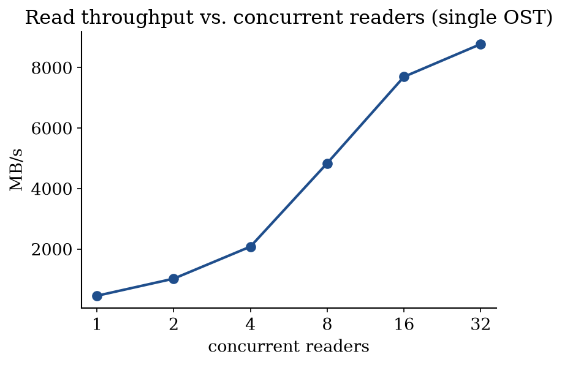
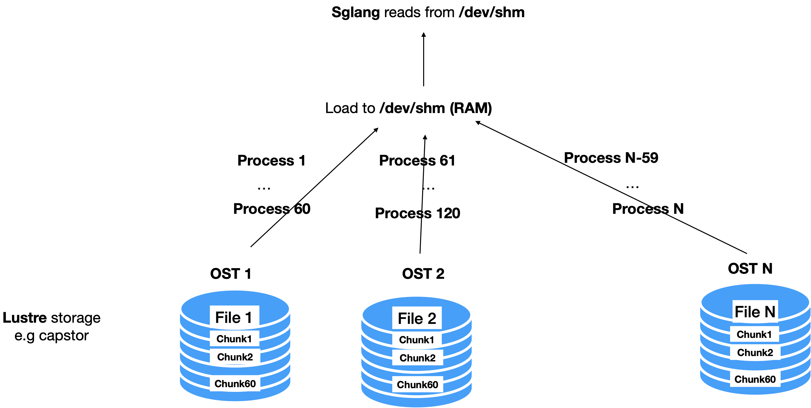
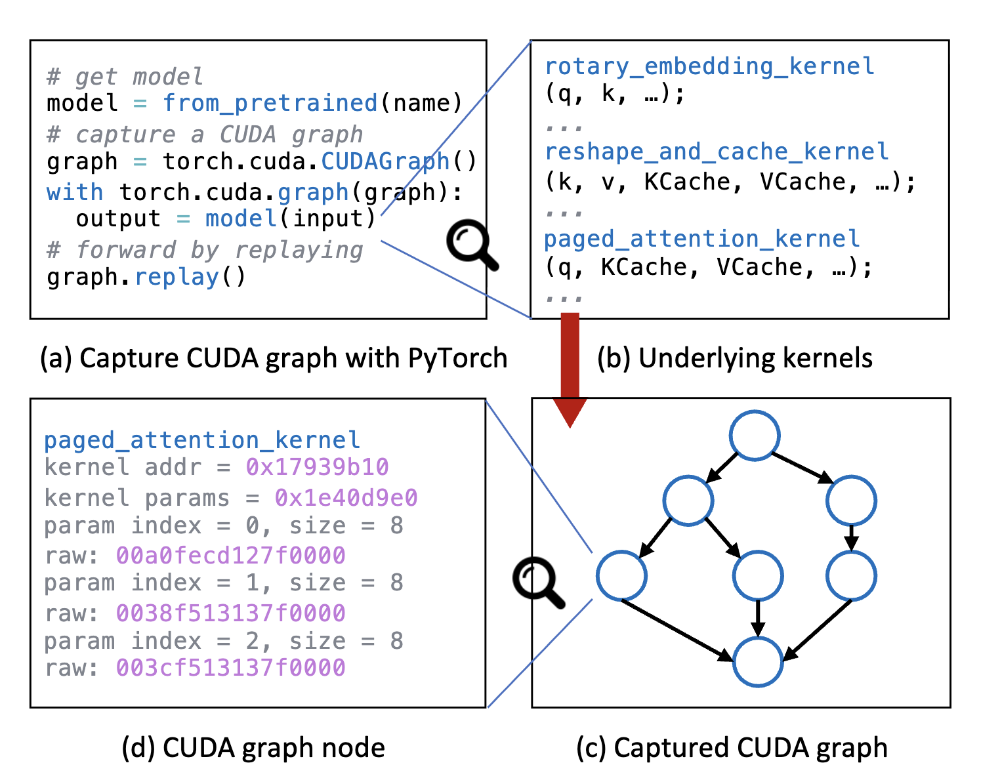

# Cold Start Elimination for SwissAI Model Launch

<p align="center">
  
  &nbsp;&nbsp;&nbsp;
  
  &nbsp;&nbsp;&nbsp;
  
</p>

*This work was conducted as a summer internship at the EPFL AI Center, with supervision from Xiaozhe Yao.*


Access to LLMs is crucial for academic research, be it for AI research, model testing or data annotation. For this reason, the SwissAI initiative operates an LLM serving platform on top of CSCS's Alps Clusters using [OpenTela](https://about.yao.sh/posts/opentela-swissai/) to pool together serving instances of multiple users in a decentralized manner and [SML](https://github.com/swiss-ai/model-launch) to seamlessly spin up nodes on top of `slurm` or CSCS's FireCrest. However, the current model launch suffers from large cold start times, which can be a bottleneck for research and development. In fact, an SGlang or VLLM server must first go through many costly steps before it can serve requests, including loading the model weights to GPU memory, computing CUDA Graphs, compiling JIT kernels and initializing NCCL communication. This can take tens of minutes for large models. 

This post walks through the cold start elimination experiments for the SwissAI model launch: what we tried, what worked, and what didn't. We shipped what worked into a package called [<a href="https://github.com/eth-easl/servekit"></a> **Servekit 🧊 → 🔥**](https://github.com/eth-easl/servekit). <br>Servekit wraps sglang launches and cuts weight loading from minutes down to single-digit seconds with our lustre storage. CRIU and CUDA graph checkpointing on the other handboth hit walls we couldn't get around on our clusters. 

## Table of Contents

- [I. Time Breakdown](#i-time-breakdown)
- [II. Weight Loading](#ii-weight-loading)
  - [1. The default weight loader and mmap](#1-the-default-weight-loader-and-mmap)
  - [2. Understanding the lustre data storage](#2-understanding-the-lustre-data-storage)
  - [3. Fast weight loading with servekit](#3-fast-weight-loading-with-servekit)
- [JIT Compilation](#jit-compilation)
- [III. CUDA Graphs](#iii-cuda-graphs)
- [IV. CRIU](#iv-criu)
  - [Local results](#local-results)


## I. Time Breakdown

We first map the cold start steps to their wall-clock time to identify the bottlenecks. We do this by parsing the logs printed by the SGLang server during the cold start phase. We added the log parser to `servekit` as `servekit profile`. 

For this experiment, we use `Llama-3.1-70B-Instruct` served with SGLang v0.5.10 (image `lmsysorg/sglang:v0.5.10`) with tensor-parallel size 4 on a single Bristen cluster node, with weights loaded with the default sglang model loader. SML keeps models in `capstor/store`, which is a [Lustre](https://www.lustre.org/) file system.  

/users/yboughizane/scratch/simple-serving-stack/experiments/lustre-loading-exp/results/meeting-sweep/2026-08-21/phase1_3_e2e-mmap-80022-nid002293-profile.json

| phase | duration_s | explanation |
|---|---|---|
| process_startup | 24.59 | Process launch, mostly Python `import`s |
| tp_worker_spawn | 16.11 | Spawning the tensor-parallel worker processes |
| torch_distributed_init | 3.13 | Initializing the NCCL / torch distributed process group |
| unknown | 1.85 |  |
| weight_loading | **652.19** | Reading the model weights from storage and copying them to GPU memory |
| cuda_graph_capture | 31.96 | Capturing Decode CUDA graphs. In practice, this is mostly JIT compilation happening during the graph capture's forward passes.  |
| piecewise_cuda_graph_capture | 82.79 | Capturing piecewise CUDA graphs (cuda graphs for prefill) |
| http_bind | 1.89 | Binding the HTTP server socket |
| warmup_request(JIT) | 15.00 | Warmup request that triggers remaining JIT kernel compilation |
| **total** | **826.05** | |

## II. Weight Loading

As we can see, loading weights from persistent storage (`capstor/store`) is by far the most time-consuming step, with **78%** of the total cold start time. **652.19** seconds for a 70B (130GB) model is a lot, that is **0.2GiB/s**. [Capstor's aggregate theoretical bandwidth](https://docs.cscs.ch/alps/storage/) (across all users and jobs) is a whopping **1.19 TB/s**, and we are connected to it with [4 HPE Cray Slingshot-11 NICs](https://docs.cscs.ch/alps/hardware/#alps-high-speed-network) with a combined bandwidth of **4x23.28 GiB/s**. So we should definitely do better than **0.2GiB/s**. Let's understand why this happens.


*Why is the default weight loader so slow in our setup?*

### 1. The default weight loader and mmap

The default SGLang loader uses `mmap` to load the weight files. 

But what is `mmap`? `mmap` is a system call that maps a virtual memory region to a file. That memory region will not be mapped to a physical memory region until it is accessed. When a `mmap`ed page is accessed for the first time, the kernel will realize that the virtual page does not have a corresponding physical page but is `mmap`ed to a file. So it will load the corresponding file page from disk to the page cache and then associate the virtual page with the page cache page. This is called a **major page fault**. On subsequent access, the virtual page is already mapped to a physical page in the page cache and no disk access is needed. This is called a **minor page fault**. [^1]

Concretely, the `DefaultModelLoader` calls methods like `multi_thread_safetensors_weights_iterator`, which return an iterator over pairs (`tensor_name`, `tensor_weights`) where `tensor_weights` is a `mmap`'ed tensor. This iterator is passed to `LlamaForCausalLM`, which passes each parameter (like `ColumnParallelLinear`) its tensor weights. The parameter will then get a view of its needed weights according to its rank (`tp_rank` in the case of `ColumnParallelLinear`) and will then initiate a host (CPU) to device (GPU) copy of the weights.

<p align="center">
  
</p>

Our hypothesis is that this triggers a **major page fault** for each page touched, which gets loaded from Lustre going through the network to the page cache and then copied to GPU. This would be a very slow process, especially for large models with many tensors spread over many pages. 

To check this, we run the exact same experiment with sglang's `--weight-loader-disable-mmap`, which skips `mmap` entirely. 

We get **45.7s** for weight loading, which is **14x faster** than the default loader and corresponds to **2.8GiB/s**. 

> **Lesson.** For weight loading using an HDD-backed Lustre file system, using `mmap` is a bad idea. The simple `--weight-loader-disable-mmap` flag is a huge improvement.


This still leaves another possible explanation: maybe it's not `mmap` itself but the many small host-to-device copies it causes. Let's try another one-flag method that does not use `mmap`: `fastsafetensors` (`--load-format fastsafetensors`) partitions files across TP ranks; each TP process reads a file with `pread` and then exchanges the weights with other TP ranks using NCCL communication. *Once all weights are on each GPU, tensors are parsed one by one directly in GPU memory*. This eliminates the need for small tensor copies from host to device. If the small copies were the real bottleneck, this should beat `--weight-loader-disable-mmap`.

We get **59.1s** for weight loading, which is **11x faster** than the default loader but worse than `--weight-loader-disable-mmap`. This confirms again that the bottleneck was `mmap` and not the small tensor copies from host to device.

This is a huge improvement and shows that `mmap` is not suitable for weight loading on Lustre file systems. However, **2.8GiB/s** is still far from the theoretical maximum of **4x23.28 GiB/s**. Let's see if we can do better.

- The no-mmap techniques are very sensitive to the number of CPUs. 


### 2. Understanding the lustre data storage

Let's set SGLang aside for a moment and ask a simpler question:  

*Irrespective of SGLang, How fast can we load files from Lustre?*

 Lustre is a distributed file system that saves files across different *Object Storage Targets (OSTs)*. Each OST is a storage volume that can be accessed independently. To increase the read bandwidth, we need to distribute the model weights across multiple OSTs so we can benefit from parallelism across OSTs. In our case, we will have each `.safetensors` file in a different OST. For models like `LLama-3.1-70B-Instruct`, there are 30 `.safetensors` files. 


<p align="center">
  
</p>

However, single OSTs also benefit from having many requests in flight.

*How many parallel readers does a single OST need to reach its full read bandwidth?*

To answer this, we will experiment with `dd iflag=direct`. This command lets us read files from disk without going through the page cache. We can use it as follows 
`dd iflag=direct if=input.bin of=output.bin bs=16M`, here `bs=16M` is the block size, which is the amount of data read from disk in one request. In our experiment, we will use `bs=16M` and read to `/dev/null` to measure the read speed. We study the effect of the number of parallel `dd` processes on the read speed. 

```bash
per=$(( 64 / nprocess ))            
t0=$(date +%s.%N)
for ((i=0;i<nprocess;i++)); do
dd if="${SICK}" of=/dev/null bs=16M skip=$((i*per)) count=$per iflag=direct status=none &
done
```

We measure this on a single 5GB shard (bs=16M, O_DIRECT, `dev/null`), sweeping the number of parallel `dd` processes reading disjoint, contiguous byte ranges of the same file:

<p align="center">
  
</p>

Throughput scales close to linearly with reader count up to 16, then flattens. With many processes, we are able to keep many RPCs in flight, improving the bandwidth. 

> **Lesson.** To maximize bandwidth on Lustre storage with `O_DIRECT` reads (no page cache), we need parallelism both across OSTs and within a single OST.

Equipped with this knowledge, we try the following:
* Load in parallel (60 processes per file, this is maybe too much) from Lustre to `/dev/shm` (RAM), and then use a normal `mmap`-based default loader from `/dev/shm` to GPU. The staging takes `7s`, which is `**> 18GiB/s**`, already much better than everything we have seen before. The weight loading takes `20s`, which is `> 6GiB/s`. This is a **16x speedup** over the default loader.

<p align="center">
  
</p>

* This idea is possible because each node in both our clusters (Bristen and Clariden) has more RAM than GPU RAM. This means a node's specific shard of weights can always be stored in RAM if we preshard the weights across nodes. This is what we do next. We use `--load-format sharded_state`, which lets us save our weights by their TP rank. One added benefit is that our weights are now contiguous for each rank, which speeds up our H2D reads (see below). 

* Staging to `/dev/shm` is better than warming up the page cache for models that don't fit in a single node. For these, to warm all the weights a rank needs, we would need to fill the page cache with weights that don't fit. 

* Staging to `/dev/shm` is different from using `--weight-loader-disable-mmap` in two ways. 
    1. With `--weight-loader-disable-mmap`, each rank still reads the complete model weights: although it discards most of it and keeps only its shard, it still reads all of it. 
    2. Implementation: the standard `--weight-loader-disable-mmap` has 8 threads by default, each running a `pread` on a file. If our files are big, this will overflow RAM. 


*Weight loading experiments (s), Bristen*

| config | weight_loading (s) | speedup | total cold start (s) |
|---|---|---|---|
| default loader | 453.7 | 1.0× | 629.8 |
| nommap | 45.7 | 9.9× | 214.7 |
| fastsafetensors  | 59.1 | 7.7× | 230.0 |
| /dev/shm staging + mmap | 20.1 + 7.7 (stage) | 16.3× | 194.7 |
| /dev/shm + TP-presharded | 8.8 + 7.4 (stage) | 28.0× | 170.8 |
| /dev/shm staging+ presharded + overlap | 9.7 | 47.0× | 179.0 |

* To avoid corrupting our results with any kind of caching, we run the methods in **reverse order** of expected speed and on different nodes, meaning `dev/shm + presharded + overlap` ran before the default loader experiment. 


lustre-loading-exp/results/meeting-sweep/bristen-2026-08-24-cpu128

### 3. Fast weight loading with servekit

/users/yboughizane/scratch/simple-serving-stack/experiments/lustre-loading-exp/results/meeting-sweep/bristen-2026-08-24-cpu128/results.md

I packaged the above ideas into a package called `servekit` that can be used to launch SGLang servers with fast cold starts. The goal is for `servekit` to be a wrapper around SGLang that implements cold start elimination optimizations. Currently, `servekit` implements fast weight loading and JIT kernels caching (more on this later). 

[`servekit`](https://github.com/eth-easl/servekit) has a main command, `servekit launch`, which takes a normal sglang command as an argument and launches it with optimizations. 

```bash
servekit launch --servekit-artifact-path <dir> \
  -- python -m sglang.launch_server --model-path <model> --tensor-parallel-size 4 ...
```

`servekit` also offers several utilities, such as `servekit profile`, `servekit bench` and `servekit verify`, to profile a cold start, benchmark a running server (useful to check that throughput is not affected by the optimizations), and verify that the server produces the same numbers as a trusted reference (useful for correctness checks: correctness is not affected by the optimizations). You can find documentation for these commands in the [servekit README](https://github.com/eth-easl/servekit/blob/main/README.md).


experiments/servekit-eval/results/results.md

**Comprehensive results**


*Config*

| | Apertus-8B-Instruct-2509 | Llama-3.1-70B-Instruct | GLM-4.7 |
|---|---|---|---|
| size | 16 GB | 141 GB | 717 GB |
| parallelism | TP4 | TP4 | TP4-PP4 |

This sweep uses SGLang v0.5.16 (image `lmsysorg/sglang:v0.5.16`).

*Weight loading time (s) on Bristen*

| Loader | Apertus-8B-Instruct-2509 | Llama-3.1-70B-Instruct | GLM-4.7 |
|---|---|---|---|
| default loader (mmap) | 78.0 | 737.0 | 827.9 |
| -`-weight-loader-disable-mmap` | 9.5 | 46.0 | 294.9 (num_threads=4) |
| `--load-format fastsafetensors` | 17.9 | 61.3 | 143.8 |
| servekit (shm, no overlap) | 3.3 + 2.0 | 9.3 + 14.2 | 10.6 + 16.4 |
| **servekit (shm, overlap)** | **2.1** | **14.3** | **16.2** |


*Weight loading time (s) on Clariden*

| Loader | Apertus-8B-Instruct-2509 | Llama-3.1-70B-Instruct | GLM-4.7 |
|---|---|---|---|
| default loader (mmap) | 92.8 | 794.2 | 861.6 |
| `--weight-loader-disable-mmap` | 4.5 | 27.8 (num_threads=4) | 263.7 (num_threads=2) |
| `--load-format fastsafetensors` | 11.9 | 48.6 | 113.8 |
| servekit (shm, no overlap) | 1.1 + 0.9 | 5.1 + 6.0 | 40.8 + 6.5 |
| **servekit (shm, overlap)** | **0.9** | **6.0** | **6.7** |


 
* `-weight-loader-disable-mmap` ooms on GLM-4.7, so we had to reduce the number of threads to 4 on bristen and 2 on clariden. Similary, it ooms on Llama-3.1-70B-Instruct on clariden, so we had to reduce the number of threads to 4. 
* `fastsafetensors` does not work for multi-node currently, the reported result for GLM4.7 is a patched version. 


**servekit's limitations**

- Presharding the models implies a separate prepare step; `servekit` tries to simplify this by doing it automatically on the first run, so users don't need to worry about it. In fact, when running `servekit launch --servekit-artefact-path <path> python -m sglang.launch_server ...`, a presharded copy of the model is created in `<path>`. This causes a first run to be slower than the default loader. 
- `ShardedStateLoader`, the loader behind `--load-format sharded_state`, is not a completely mature path. I discovered multiple bugs in it that I raised to the SGLang team: 
    - [mxfp4 + sharded_state load format silently drops expert weights (gpt-oss-20b)](https://github.com/sgl-project/sglang/issues/34448) (#34448)
    - [`sharded_state` cannot save and load an MLA model](https://github.com/sgl-project/sglang/issues/35702) (#35702)

  We are also involved in fixes for these: 
    - [Manually register kv_b_proj to attn_mha so mla model work with ShardedModelLoader](https://github.com/sgl-project/sglang/pull/35715) (#35715)
    - [Preserve MXFP4 Triton weights in sharded state](https://github.com/sgl-project/sglang/pull/34558) (#34558)
- I made `--overlap` as an opt-in flag because for now, it is unsafe. We did not yet implement a barrier mechanism to ensure that the engine does not start before the staging is complete. This is a known issue and we are working on it.

**servekit vs. the other loaders**

| Method | Pros ✅| Cons ❌|
|---|---|---|
| default loader (mmap) |  | Really slow on Lustre |
| `--weight-loader-disable-mmap` | One flag, 2.8x to 16x faster than default | - OOMs on large models (GLM-4.7), needed `num_threads=4` to fit<br>- Loads all weights per rank so scales badly with model size |
| `--load-format fastsafetensors` | - One flag, significant speedups | Doesn't work for multi-node yet; GLM-4.7 result needed a patched version<br> - Scales badly with node count due to costly NCCL though Slingshot |
| servekit | - Fastest across all models <br>- If model size scales linearly with node count, weight size loaded by node is constant and so is time (see LLama vs GLM4.7, 14s vs 16s)  | - Slower first run<br>- Relies on `ShardedStateLoader`, a correctness check is needed |

## II. JIT Compilation

With weight loading fixed, we will take a look at `cuda_graph_capture`(28s) and `warmup_request(JIT)`(15s). While the latter is clearly a JIT compilation phase, the former is a bit more subtle: it is a graph capture phase that triggers JIT compilation during the forward passes of the graph capture. JIT compilation is expensive but simple to cache! SGlang offers already some environment variables to specify a cache directory for the JIT compilation artifacts:
* `TRITON_CACHE_DIR`
* `TVM_FFI_CACHE_DIR`
* `FLASHINFER_WORKSPACE_BASE`

By default, these are set to `$HOME/.cache/triton`, `$HOME/.cache/tvm-ffi` and `$HOME/.cache/flashinfer` respectively. However, on the clusters, `$HOME` is ephemeral and wiped at the end of every job. To cache these artifacts, we can set these environment variables to a persistent directory. 

We persist these to `--servekit-artifact-path` (the same path where we persist the presharded weights). In SML, we expect the first model run that prepares the model to be done by a maintenanter that has write access to this path. However, users will not necessarily have write access to this path, if we naively set their cache directories to this path, they will try to write to it and fail. So we made each launches make a copy of these jit cache directories to a temporary directory in `/tmp` and set the environment variables to point to this temporary directory. This way, users can read from the persistent cache but write to their own temporary cache. We also made sure these caches work cross nodes. 


## III. CUDA Graphs

Cuda graphs capture a sequence of CUDA operations (kernel launches, memcpy, etc.) into a single graph of computation. For example, the following code snippet:

```python
def forward(x):
  a = f(x)
  b = g(a)
``` 

becomes the graph : `f --> g`. CUDA graphs are useful to reduce the overhead of kernel launches, especially for small kernels. In our case, cuda graphs take a significant amount of time to capture especially:
* `piecewise_cuda_graph_capture` (79s) for prefill CUDA graphs. 
* `cuda_graph_capture` (32s) for decode CUDA graphs. 

The issue with CUDA graphs is that their nodes takes as argument **fixed device pointers** (pink pointers in the illustration below). This that in the example above, `f`'s node encodes x's **device pointer**. These virtual device addresses are cuda-context specific. This means that we cannot save the graphs to disk, and replay them in a different context. 

> **Lesson.** CUDA graphs cannot be saved to disk and reused across different contexts. 

Multiple methods try to solve this issues. **Medusa** [^2] patches the CUDA graphs node to replace the fixed device pointers with a **virtual pointer**, using hand-written rules per kernel to rewrite addresses on restore. However, these patching rules are kernel-specific and break easily. They don't keep up with new kernels/libraries or non-uniform model architectures (e.g. dense+MoE).

**Foundry [^3]** on the other hand, intercepts the memory allocation API and makes it return the same virtual addresses every run, so captured pointers stay valid with no per-kernel patching. However, it currently lacks TP support and doesn't capture prefill graphs (`piecewise_cuda_graph_capture`), which account for most of the CUDA graph capture time.

Both these methods are at research stage and not ready for production-like environments, which is why we did not use them.
<p align="center">
  
  <br>
  <sub>Source: <a href="https://dl.acm.org/doi/epdf/10.1145/3669940.3707285">Medusa: Accelerating Serverless LLM Inference with Materialization</a></sub>
</p>


## IV. CRIU

<p align="center">
  
</p>

**CRIU** (checkpoint restore in user space) is a Linux utility that can checkpoint a running CPU process to disk and restore it later. 

On the GPU side, NVIDIA offers **cuda-checkpoint**, a driver that checkpoints a CUDA context and all of its device memory to RAM. This means that 

Combining these tools, we can first checkpoint all cuda contexts to RAM using `cuda-checkpoint`, then checkpoint the CPU process using CRIU. And voila, we have a checkpoint of the CPU and GPU. This technique is now natively integrated in a CRIU plugin: CRIU-gpu. 

In our case, we want to checkpoint a warm SGLang server to disk and restore it later. This would allow us to cut off the elusive `piecewise_cuda_graph_capture` and `cuda_graph_capture` times, along with library imports `process_startup` and `tp_worker_spawn`. 

### CSCS


Not, so fast. CRIU has one major limitation: it needs priviledges. It's least priviledged mode (`--unprivileged`), still requires:
* `CAP_CHECKPOINT_RESTORE` and `CAP_SYS_PTRACE` capabilities on the CRIU binary. (see [docs](
https://github.com/checkpoint-restore/criu/blob/criu-dev/Documentation/criu.txt))
* A container that does not have a syscall filter i.e with `Seccomp:0`. A non zero `seccomp` indicates a specific syscall filter and CRIU currently refuses to run in such containers.


On our CSCS clusters, we cannot obtain these capabilites. Moreover, the `enroot` containers commonly used for our SLURM jobs add a seccomp filter, which makes CRIU unusable. 

> **Lesson.** We cannot use CRIU on CSCS slurm clusters. 

We still explore CRIU on our local machines for a complete assessment of the potential of this technique. 

### Local results

We tested checkpoint/restore on a local machine with 2x RTX 3060 GPUs (12GB each), using `Qwen2.5-3B-Instruct`. We checkpointed a warm, already-serving SGLang server and restored it. 

*Results with 1x RTX 3060, 12GB VRAM, 16GB RAM, Ubuntu 22.04, SGLang v0.5.10* 
| path | time to serving | speedup vs cold start | checkpoint time | explanation |
|---|---|---|---|---|
| cold launch (weights + JIT compile) | 109.8s | 1x | — | |
| naive restore | 23.3s | 4.72x | 34.7s (15GB snapshot) | Save everything, including the GPU weights. |
| thin restore | 17.4s | 6.31x | 11.6s (4.6GB snapshot) | Free the model weights right before saving, then reload them from disk on restore. |

To free and reload the weights for the thin snapshot, we use SGLang's `/release_memory_occupation` and `/resume_memory_occupation` HTTP endpoints, which let you drop and reload model weights (and KV cache) on a running server without restarting it. See the [SGLang docs](https://docs.sglang.io/docs/advanced_features/sglang_for_rl) for details.

Getting a full SGLang server to checkpoint and restore cleanly, and to be **reusable** (restored from more than once), also required working around a few CRIU quirks:
* **Semaphore**: SGLang creates a POSIX semaphore in `/dev/shm`. By default CRIU prefers to not include the semaphore in the checkpoint, so it creates and saves a hard-link to it. However, this means that when one restore succeeds and tears down, it will clear the semaphore and it will be deleted from the filesystem. Without a semaphore in the filesystem anymore, the checkpoint becomes unusable for further restores. To solve this, we need to tell CRIU to include the semaphore in the checkpoint as a **ghost file** instead of a hard-link. We do this by unlinking the semaphore from `/dev/shm` before checkpointing, the inode stays alive as the SGLang process has an open file descriptor to it. CRIU includes unlinked files in the checkpoint as ghost files, to be sure it finds them on restore. 
* **Log file size**: CRIU records the server's log file by path *and size*, and refuses to restore if that size changed (which it will, since the restored process keeps appending to it). We reset the log to its snapshot-time size before every restore. 
* **TCP connection**: CRIU normally preserves open TCP connections across dump/restore, but that needs a privilege (`CAP_NET_ADMIN`) we don't have. We instead tell CRIU to just close the connection (`--tcp-close`). This is harmless in the **1 GPU case** as we do not use NCCL connections between GPUs. 

*Results with 2x RTX 3060, 12GB VRAM each, Ubuntu 22.04, SGLang v0.5.10, `--tensor-parallel-size 2`*

Without the `CAP_NET_ADMIN` capability, we have to `--tcp-close` on dump. This also force-closes the TCPStore connection that `ProcessGroupNCCL` keeps open between the two TP ranks. A background heartbeat thread polls this connection for the lifetime of the process, not just at init. After restore, the connection is dead, so the poll fails and the rank crashes.

We could work around this at the application level. We would need to patch SGLang to destroy the process group before checkpointing, then rebuild it (fresh TCPStore + `ncclCommInitRank`) after restore. This is the same approach vLLM's own CUDA-checkpoint RFC takes [^4]. But rebuilding the process group invalidates the old NCCL communicator handles. CUDA graphs that captured NCCL collectives embed those handles, so they would need to be re-captured too. This defeats the point of checkpoint/restore in the first place.

`CAP_NET_ADMIN` is a powerful capability that we could also not get on our clusters. We still tested it on our local machine, for completeness. However, for a real deployment, a workaround needs to be used. 

| path | time to serving | speedup vs cold start | checkpoint time |
|---|---|---|---|
| cold launch (weights + JIT compile) | 91.2s | 1x | — |
| naive restore | 29.2s | 3.12x | 61.9s (29GB snapshot) |
| thin restore | 19.8s | 4.62x | 18.1s (9.5GB snapshot) |


* **PSM shared-memory file**: like the semaphore above, a libfabric/PSM file under `/dev/shm` (only present at TP>1) was getting deleted by the first restore's process on exit, making the snapshot single-use. We fixed it the same way: unlink it before checkpointing so CRIU includes it as a ghost file.

> **Lesson.** Multi-GPU checkpoint/restore is possible with CRIU and CUDA-checkpoint, but requires `CAP_NET_ADMIN` which is not available on clusters. 

[^1]: A threadpool of size 8 is used to do mmap in parallel. 

[^2]: [Medusa: Accelerating Serverless LLM Inference with Materialization](https://dl.acm.org/doi/epdf/10.1145/3669940.3707285)

[^3]: [Foundry: Template-Based CUDA Graph Context Materialization for Fast LLM Serving Cold Start](https://arxiv.org/abs/2604.06664)

[^4]: [vllm-project/vllm#34303](https://github.com/vllm-project/vllm/issues/34303)

